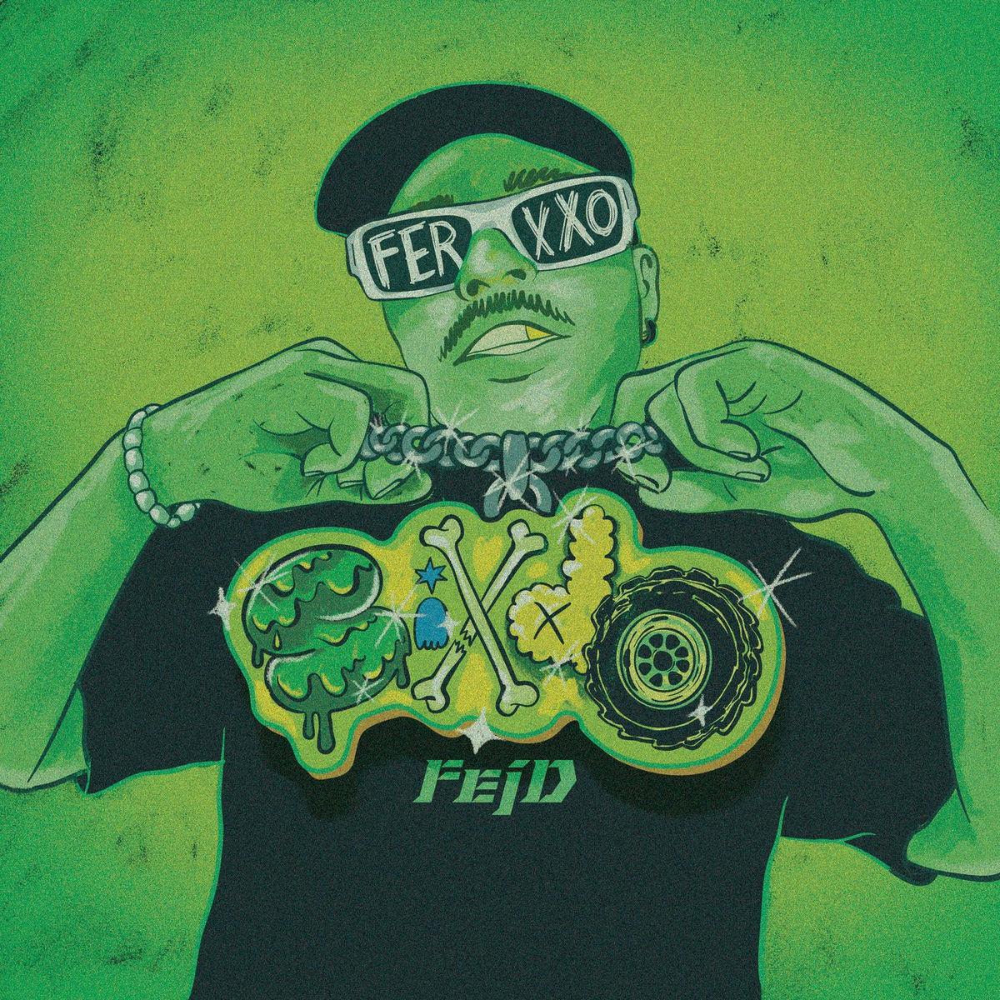
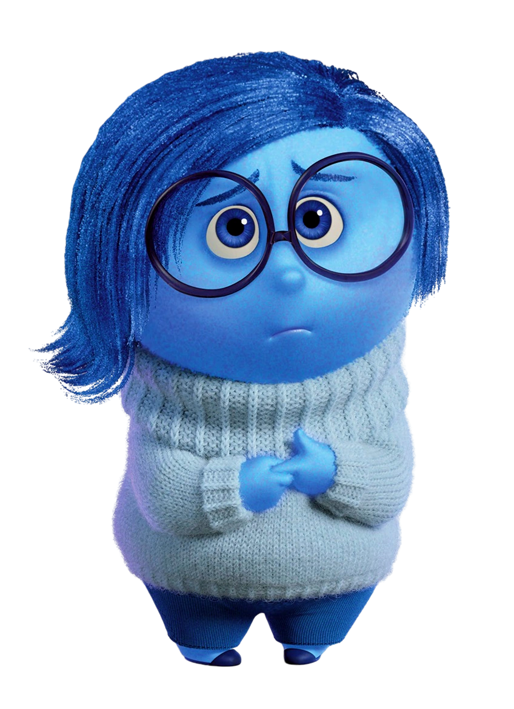

# Proyecto Informatico 2

## Integrantes del grupo :

### Zaira Machuca
### Xiomara Ureña 

#CODIGO

<!DOCTYPE html>
<html lang="en">
<head>
    <meta charset="UTF-8">
    <meta name="viewport" content="width=device-width, initial-scale=1.0">

    <title>Tienda Discos</title>
    <link href="https://cdn.jsdelivr.net/npm/bootstrap@5.3.8/dist/css/bootstrap.min.css" rel="stylesheet" integrity="sha384-sRIl4kxILFvY47J16cr9ZwB07vP4J8+LH7qKQnuqkuIAvNWLzeN8tE5YBujZqJLB" crossorigin="anonymous">
    
    <link rel="stylesheet" href="https://cdn.jsdelivr.net/npm/bootstrap-icons@1.13.1/font/bootstrap-icons.min.css">
</head>

<body>

  <nav id="navbar-example2" class="navbar bg-body-tertiary px-3 mb-3">
    <a class="navbar-brand" href="#">Menú</a>
   <ul class="nav nav-pills">
    <li class="nav-item">
      <a class="nav-link" href="#scrollspyHeading1">DISCOS</a
    </li>

    <li class="nav-item">
      <a class="nav-link" href="#scrollspyHeading2">STICKERS</a>
    </li>

    <li class="nav-item">
      <a class="nav-link" href="#scrollspyHeading3">LIBROS</a>
    </li>

    <li class="nav-item">
      <a class="nav-link" href="#scrollspyHeading4">CARRITO</a>
    </li>

   </ul>
  </nav>

    

    

        <h4 id="scrollspyHeading1">DISCOS</h4>
        

        

            

    

        

        

        

            <input type="checkbox"id="En vinilo">
            <label for="En vinilo">En vinilo(10k extra)</label>
        

        

            <button onclick="Agregardisco('Las leyendas nunca mueren - Anuel aa', 40000)">Agregar Disco</button>
        

        

        

            <h5 class="card-title">Las leyendas nunca mueren</h5>
        

        

    

    

        

        

        

            <input type="checkbox"id="En vinilo">
            <label for="En vinilo">En vinilo(10k extra)</label>
        

        

            <button onclick="Agregardisco('La vida es una - Myke Towers', 30000)">Agregar Disco</button>
        

        

        

            <h5 class="card-title">La vida es una</h5>
        

        

    

    

        

        

        

            <input type="checkbox"id="En vinilo">
            <label for="En vinilo">En vinilo(10k extra)</label>
        

        

            <button onclick="Agregardisco('Un verano sin ti - Bad Bunny', 50000)">Agregar Disco</button>
        

        

        

            <h5 class="card-title">Un verano sin  ti</h5>
        

        

    

    

        

        

        

            <input type="checkbox"id="En vinilo">
            <label for="En vinilo">En vinilo(10k extra)</label>
        

        

            <button onclick="Agregardisco()">Agregar Disco</button>
        

        

        

            <h5 class="card-title">Trinidad Bendita - Blessd</h5>
        

    

  

    

        

        
        

            <input type="checkbox"id="En vinilo">
            <label for="En vinilo">En vinilo(10k extra)</label>
        

        

            <button onclick="Agregardisco()">Agregar Disco</button>
        

        

        

            <h5 class="card-title">Sixdo - Feid</h5>

        

        

    

    

        

        

        

            <input type="checkbox"id="En vinilo">
            <label for="En vinilo">En vinilo(10k extra)</label>
        

        

            <button onclick="agregarDisco()">Agregar Disco</button>
        

        

        

            <h5 class="card-title">Viva el perreo - Jowell y Randy</h5>
        

        

    

    

        

        

              <h4 id="scrollspyHeading2">STICKERS</h4>
            <button type="button" style="border: 1; background-color: transparent;" class="btn btn-secondary" data-bs-toggle="tooltip" data-bs-placement="right" data-bs-title="Tos">
                
            </button>

            <button type="button" style="border: 1; background-color: transparent;" class="btn btn-secondary" data-bs-toggle="tooltip" data-bs-placement="right" data-bs-title="Tooltip on right">
                
            </button>

            <button type="button" style="border: 1; background-color: transparent;" class="btn btn-secondary" data-bs-toggle="tooltip" data-bs-placement="right" data-bs-title="Tooltip on right">
                
            </button>

            <button type="button" style="border: 1; background-color: transparent;" class="btn btn-secondary" data-bs-toggle="tooltip" data-bs-placement="right" data-bs-title="Tooltip on right">
                
            </button>

            <button type="button" style="border: 1; background-color: transparent;" class="btn btn-secondary" data-bs-toggle="tooltip" data-bs-placement="right" data-bs-title="Tooltip on right">
                
            </button>

        

        

           
        
  
    

    

        <h4 id="scrollspyHeading3">LIBROS</h4>
        

            

    

        

        

        

            <input type="checkbox"id="Tapa dura">
            <label for="Tapa dura">Tapa dura</label>
            <input type="checkbox"id="Tapa blanda">
            <label for="Tapa blanda">Tapa blanda</label>
        

        

            <button onclick="Agregar('El pequeño elfo Cierraojos', 15000)">Agregar Libro</button>
        

        

        

            <h5 class="card-title">El pequeño elfo Cierraojos</h5>
        

        

        

        

        

            <input type="checkbox"id="Tapa dura">
            <label for="Tapa dura">Tapa dura</label>
            <input type="checkbox"id="Tapa blanda">
            <label for="Tapa blanda">Tapa blanda</label>
        

        

            <button onclick="Agregar('El reglamento es el reglamento', 15000)">Agregar Libro</button>
        

        

        

            <h5 class="card-title">El reglamento es el reglamento</h5>
        

        

        

        

        

            <input type="checkbox"id="Tapa dura">
            <label for="Tapa dura">Tapa dura</label>
            <input type="checkbox"id="Tapa blanda">
            <label for="Tapa blanda">Tapa blanda</label>
        

        

            <button onclick="Agregar('El pulpo está crudo', 15000)">Agregar Libro</button>
        

        

        

            <h5 class="card-title">El pulpo está crudo</h5>
        

        

       
    

   
   
</body>
</html>
